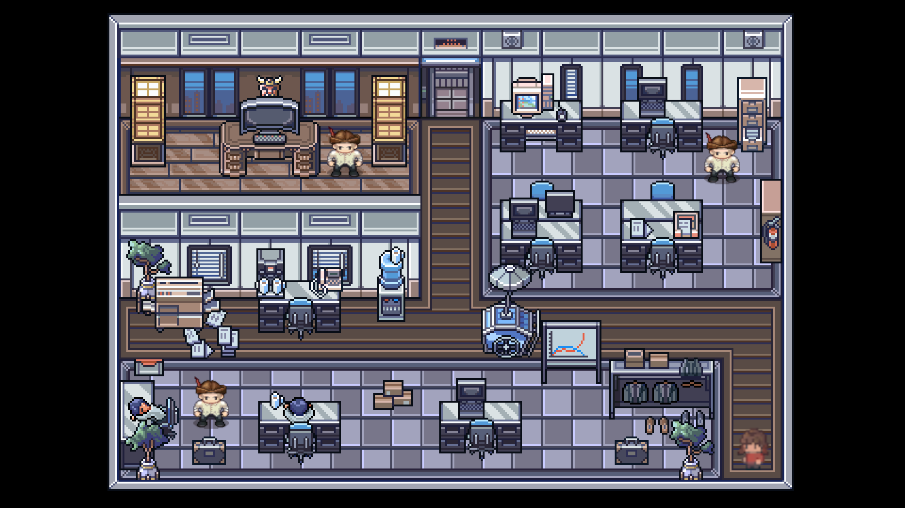
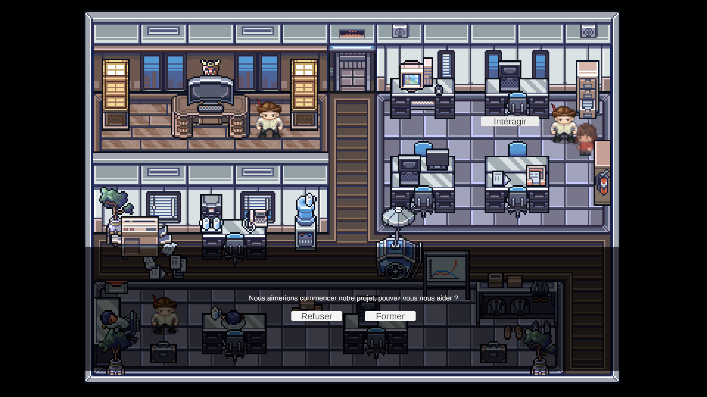
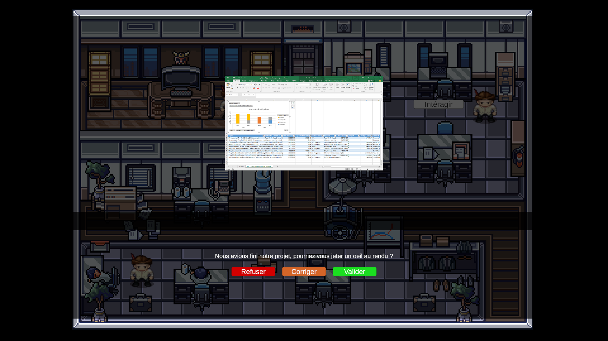

# DataQuest

Prototype de RPG de data-librarian.

Dans le jeu “DATA Quest”, vous incarnez un data librarian ambitieux au sein d’une université prestigieuse. Votre mission est de naviguer à travers les différents pôles de recherche de l’université pour former des chercheurs, aider à la rédaction de plans de gestion des données, et prendre des décisions critiques concernant le financement et la viabilité des projets de recherche. Chaque choix que vous faites a des conséquences directes sur le succès des projets, leur financement et leur stabilité à long terme.

DISCLAIMER : L'extrait que vous allez tester n'est qu'un prototype du jeu décrit dans ce cahier des charges,
 vous ne retrouverez pas toutes les fonctionnalités citées ci-dessous.

## Objectifs pédagogiques
Les objectifs pédagogiques sont de permettre au joueur de comprendre :

- Le rôle des Data Librarians
  - Comprendre les fonctions de base et l’importance des data librarians.
- La gestion des données de recherche
  - Apprendre les principes fondamentaux de la gestion des données de recherche.
- La prise de décision stratégique
  - Développer des compétences initiales en prise de décision concernant l'accord et le soutien des projets.
- L'analyse critique
  - Apprendre à analyser et à évaluer les projets de recherche en fonction de leur viabilité et de leur impact.
- Gérer la réputation de l'université, en acceptant les projets ou non

### Objectifs pédagogiques avancés

- La gestion des risques
  - Gérer les risques associés aux projets de recherche pour éviter les échecs et les pertes de financement.
- L'éthique de la recherche
  - Approfondir la compréhension de l’éthique de la recherche et de la conformité aux normes.
- Impact sur la Recherche Scientifique
  - Mesurer l’impact des actions des data librarians sur la recherche et l’innovation.

### Références

- https://fr.wikipedia.org/wiki/D%C3%A9mocratisation_de_l%27enseignement_en_France
- https://www.cairn.info/democratisation-de-l-enseignement--9782707194039.htm
- https://www.cairn.info/revue-le-telemaque-2004-1-page-135.htm
- http://ses.ens-lyon.fr/ressources/stats-a-la-une/massification-et-democratisation-de-lacces-a-lecole-et-a-lenseignement-superieur
- https://journals.openedition.org/sdt/15641
- https://blog.educpros.fr/julien-gossa/2022/02/03/50-ans-de-massification-et-apres/

## Description des fonctionnalités

## Captures d'écran du jeu

### Interface

-Caméra centré sur le joueur
-Une barre de réputation de l'université
-Une grande salle principale, 2 salles annexes qui symbolisent chacunes un département
-Une fois parlé avec un pnj, une nouvelle interface en fonction de la demande
                                                                    - former les chercheurs
                                                                    - Valider ou non les projets

Paramètres et Options :

    Un menu d’options pour régler les paramètres graphiques, audio et de gameplay pour une expérience de jeu optimale.

Barre de réussite des projets :
Barre de financement des projets :

Carte de l’Université :

    Une carte détaillée et zoomable de l’université permettant un déplacement fluide entre les différents pôles de recherche.
    Des marqueurs et des icônes pour identifier facilement les départements, les laboratoires et les zones d’intérêt.

Interface de Gestion des Projets :
    Des fenêtres contextuelles pour chaque projet affichant des informations essentielles, des objectifs et l’état de conformité aux normes de gestion des données.
    Des boutons d’action pour approuver, rejeter ou demander des modifications sur les propositions de projets.

Centre de Notifications :

    Un système de notifications pour informer les joueurs des événements importants, des urgences et des nouvelles opportunités.

### Actions du joueur

Les actions du joueur sont les suivantes :

- Former les chercheurs (L'étudiant-chercheur présente le début du projet, et le joueur reste accroché à ce moment pendant plusieurs secondes, avec une barre de progression qui se complète au bout d'un certain temps.)
- Valider ou non les projets (Une feuille représentant son travail apparaît, puis nous jugeons avec 2 boutons si oui ou non nous acceptons le projet.)
- Corriger les plans de gestion des données (Clique sur un bouton lors d'un événement)

Chaque choix peut faire évoluer la réputation de l'université.

### Scénarios

Différents scénarios sont possibles avec les équipes de recherche :

Scénario 1 : La Découverte d’une Anomalie

    Le joueur découvre une incohérence dans les métadonnées d’un projet de recherche majeur.
    Objectif : Corriger les métadonnées et former les chercheurs impliqués pour éviter de futures erreurs.
    Conséquences : Si résolu rapidement, le financement du projet est sécurisé. Sinon, le projet risque d’être suspendu.

Scénario 2 : Formation Obligatoire

    Un audit révèle un manque de compétences en gestion des données chez les chercheurs.
    Objectif : Créer et dispenser un programme de formation complet.
    Conséquences : La qualité des futures propositions de recherche s’améliore, attirant plus de financements.

## Contraintes de développement

### Modularité

C#, Unity

Le code est modularisé, par exemple en suivant le modèle MVC.

Toutes les pondérations (constantes) sont réunies dans un fichier unique.

Chaque scenario est décrit dans un fichier unique.

Les modules suivants peuvent être remplacés dans les scénarios :
- toutes les pondérations
- démographie (naissance et décès)
- statuts (type + règles de modification)
- économie (calcul du nombre d'emplois par strates)

## Fonctionnalités et scénarios avancés

Événements Aléatoires et Scénarios Dynamiques :

    Intégration d'événements aléatoires qui peuvent influencer les projets et les décisions.
    Scénarios générés dynamiquement en fonction des actions du joueur pour une rejouabilité accrue.

Crise de Confidentialité

    Situation : Un chercheur renommé est accusé de violation de données sensibles dans un projet confidentiel.
    Objectif : Mener une enquête interne pour découvrir la vérité et préserver la réputation de l'université.

Crise de Déontologie

        Situation : Un chercheur phare de l'université est accusé de pratiques de recherche douteuses.
        Objectif : Enquêter sur les allégations et prendre des mesures pour garantir l'intégrité de la recherche.
